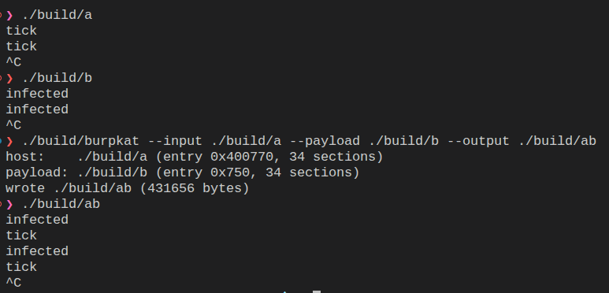

# burpkat

Combine an `ET_EXEC` or PIE (`ET_DYN`) host and a PIE (`ET_DYN`) payload into a
single `ET_EXEC`. The payload is grafted at a high load bias, its relocations
are remapped against the host's dynamic symbols, and a shellcode entry spawns
the payload on a thread before jumping to the host entry.



## Build

```sh
cmake -B build && cmake --build build
```

## Usage

```sh
burpkat -i host -p payload -o output [-d]
```

`-i/--input`, `-p/--payload`, and `-o/--output` are required; `-d` enables debug
logging. Example:

```sh
./build/burpkat -i ./host -p ./payload -o ./combined
```

## Notes

- The payload must be PIE; static PIE is not supported.
- A host that loads code from a shared library at runtime resolves it relative
  to the executable, so keep the output beside the host's libraries.
- Injected `DT_NEEDED` libraries must exist on the target's search path.
- Self-updating applications may replace rewritten binaries; keep a backup.

## Test

```sh
tests/cross/build.sh   # cross-build hosts/payloads (glibc 2.31/2.36/2.41/2.43)
tests/cross/run.sh     # host x payload matrix, ET_EXEC + PIE hosts
```
